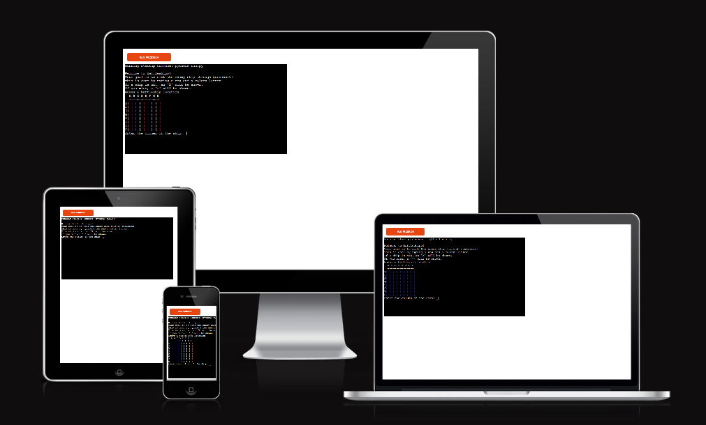
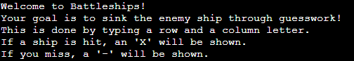
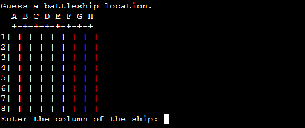
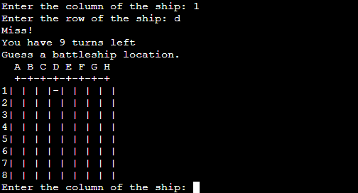
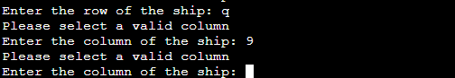
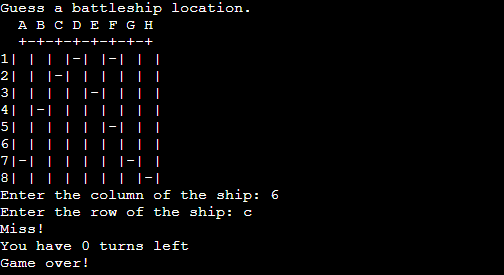

# [BATTLESHIPS](https://code-lau.github.io/battleships-code-lau)

[Deployed App Available Here](https://battleships-code-lau-4e469f63a8e0herokuapp.com/)

Battleships is a python console game based on the original Battleship game. Battleship was originally a two player guessing game, where each player would choose where to place their ships on a 9x11 grid and make guesses to hit the other players ship.

Here is a demonstration of responsiveness, done through [Am I Responsive?](https://battleships-code-lau-4e469f63a8e0.herokuapp.com/)

## UX
This game is presented entirely through the python console, and as such doesn't have any graphics or user interface. However, an effort was made to visualise the game for the player by arranging the rows and columns in a way that represents the board.

## Features

### Existing Features

**Welcome Screen & Rules**

A very rudamentary welcome screen greets the user by saying, "Welcome to Battleships!" The user is given simple instructions on how to play the game.

      
**The Game itself**

When the user starts the game, a board is shown, displaying rows and columns of letters and numbers respectively. The letters on the top row, and the numbers on the left column. The user is propmted to pick a row and a column, and depending on their choice, a mark will be placed upon the grid. If they were successful, an X will appear. If they miss, a dash - will appear. The user has 10 guesses to try before it's game over.

The board

A miss

A hit

Invalid data

Game over

### Future Features

**Multiplayer**
If possible, I would love to implement a way for two users to play together.

**Better graphics**
I would like to make actual graphics for a project like this for a better user experience.

## Tools & Technologies Used
For this project, I used gitpod and Visual Studio Code to code in. Github was used to host the repository, Github Pages for the deployment. The main site content was written with HTML. Any images used were put through TinyPng and Webp Converter to reduce the size and convert them to Webp files. This template along with the template for the TESTING.md file were generated with the Markdown Builer.

-  used to generate README and TESTING templates.
-  used for version control. (`git add`, `git commit`, `git push`)
-  used for secure online code storage.
-  used as a cloud-based IDE for development.
-  used for the main site content.
-  used for the main site design and layout.
-  used for user interaction on the site.
-  used for the main body of the game.
-  used for hosting the deployed front-end site

## Testing
For testing, please refer to the [TESTING.md](TESTING.md) file.

## Deployment

The site was deployed to Heroku through an app hosted by them. The working app can be found [here.](https://battleships-code-lau-4e469f63a8e0herokuapp.com/) It is also deployed to GithubPages, but as it is a python application, only the README appears.

### Local Deployment

This project can be cloned or forked in order to make a local copy on your own system.

#### Cloning

You can clone the repository by following these steps:

1. Go to the [GitHub repository](https://github.com/Code-Lau/battleships-code-lau) 
2. Locate the Code button above the list of files and click it 
3. Select if you prefer to clone using HTTPS, SSH, or GitHub CLI and click the copy button to copy the URL to your clipboard
4. Open Git Bash or Terminal
5. Change the current working directory to the one where you want the cloned directory
6. In your IDE Terminal, type the following command to clone my repository:
	- `git clone https://github.com/Code-Lau/battleships-code-lau.git`
7. Press Enter to create your local clone.

Alternatively, if using Gitpod, you can click below to create your own workspace using this repository.

Please note that in order to directly open the project in Gitpod, you need to have the browser extension installed.
A tutorial on how to do that can be found [here](https://www.gitpod.io/docs/configure/user-settings/browser-extension).

#### Forking

By forking the GitHub Repository, we make a copy of the original repository on our GitHub account to view and/or make changes without affecting the original owner's repository.
You can fork this repository by using the following steps:

1. Log in to GitHub and locate the [GitHub Repository](https://github.com/Code-Lau/battleships-code-lau)
2. At the top of the Repository (not top of page) just above the "Settings" Button on the menu, locate the "Fork" Button.
3. Once clicked, you should now have a copy of the original repository in your own GitHub account!

### Local VS Deployment

After testing both the local version hosted by Gitpod, and the live version hosted by GitHub Pages I observed no notable differences. This was tested on Firefox.

## Credits 
All code referenced does not belong to me, and is borrowed expressly for learning purposes.
| Source | Content | Location |
| --- | --- | --- |
| [How to Code Battleships in Python](https://www.youtube.com/watch?v=tF1WRCrd_HQ) | Help with coding the game  | Youtube |
|  | Help with  | Youtube |

## Acknowledgements
- I would like to thank my (very cool) Code Institute mentor, [Tim Nelson](https://github.com/TravelTimN) for his support throughout the development of this project.
- I would like to thank the [Code Institute](https://codeinstitute.net) tutor team for their assistance with troubleshooting and debugging some project issues.
- I would like to thank my family for help with user experience testing.