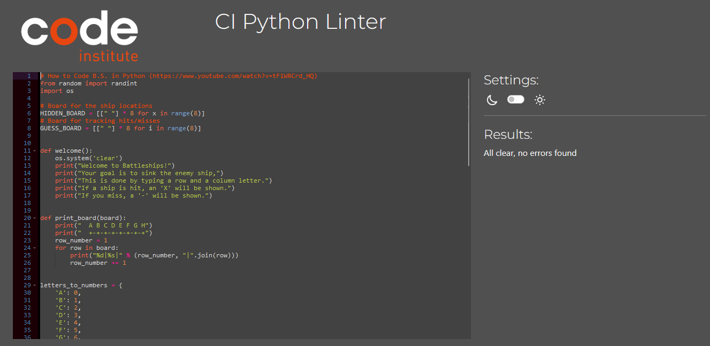
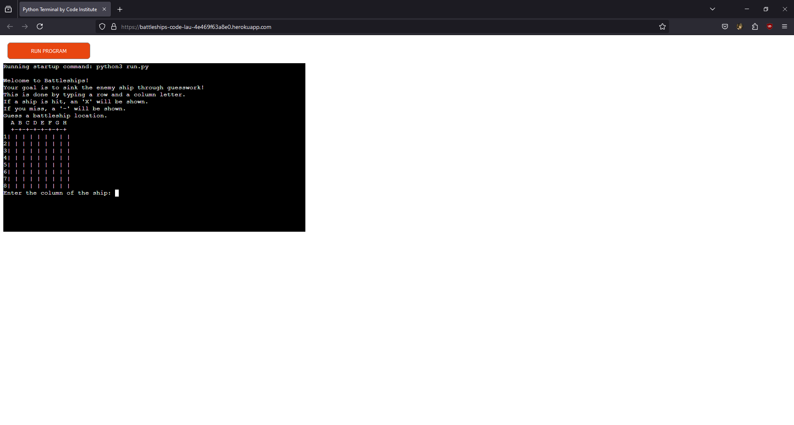
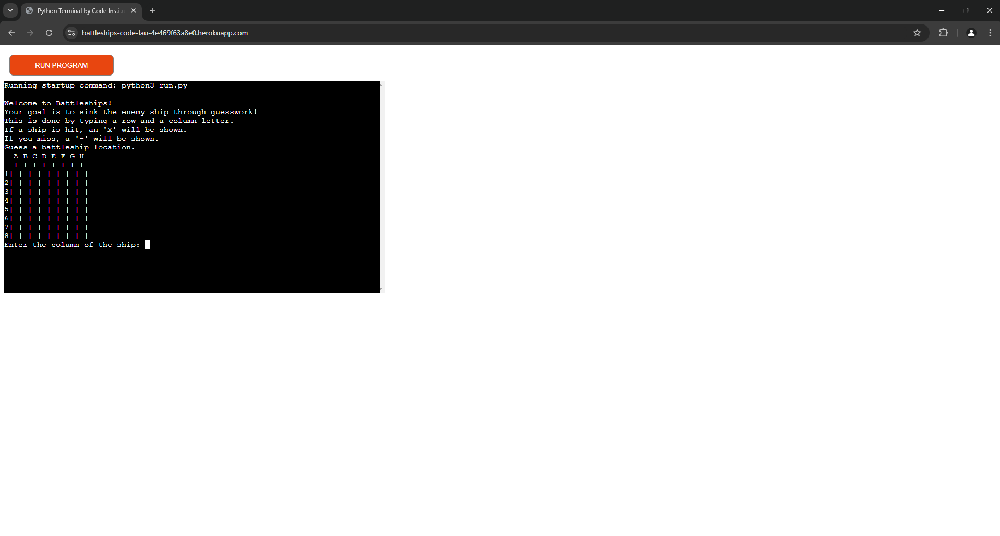
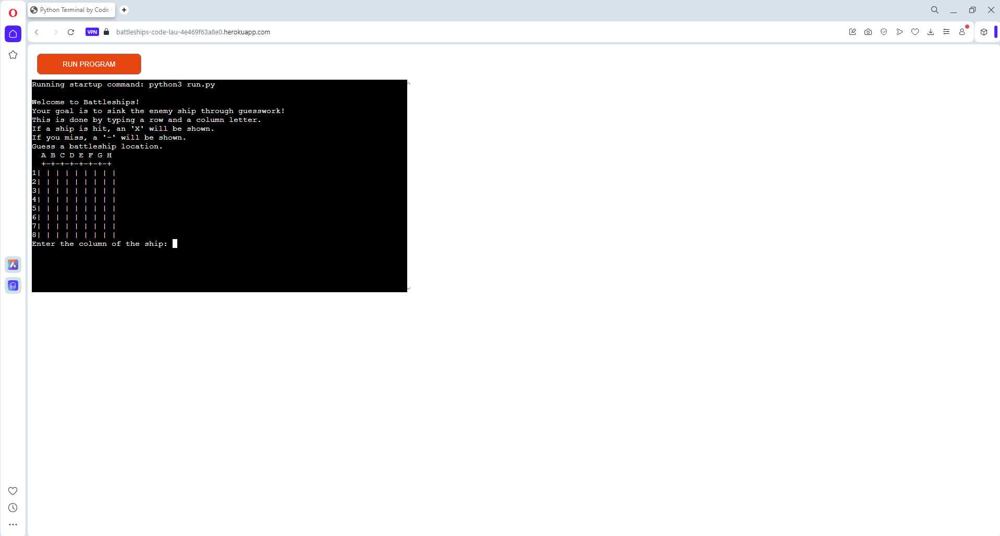
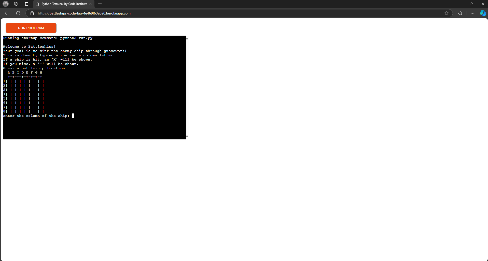

# Testing

> Return back to the [README.md](README.md) file.

## Code Validation

All files were put the their respective validators, and came back with no errors.

All HTML, CSS and/or Javascript used in this project were provided by Code Institute's template and weren't considered for testing.

### Python

For the main python file, I used [Code Institute's Python Linter.](https://pep8ci.herokuapp.com/)

## Compatibility Testing

Here I manually tested all functionality and features across all responsive sizes and browsers. For this, I used Chrome, Opera, Firefox and Edge.

**Firefox**

**Chrome**

**Opera**

**Edge** 

## Manual Testing

| Test | Goal | Outcome |
| --- | --- | --- |
| Responsiveness | Website should be responsive to all browsers | Passed |
| App Functionality | Game should run when prompted to | Passed | 
| Game Functionality | Game should run as intended | Passed |

### Bugs
There are no remaining bugs that I'm aware of.